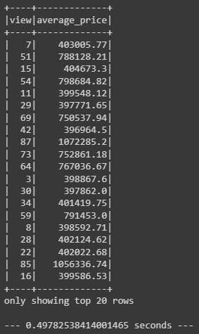

# PySpark exercise
## Overview
For this challenge we used SparkSQL to determine key metrics about home sales data. We used Spark to create temporary views, partition the data, cache and uncache a temporary table, and verify that the table has been uncached.
## Results
* Regular PySpark structure:  

* Cached table:  

* Parquet and partition by year:  
